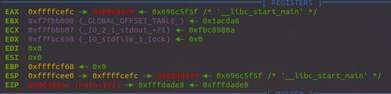

## 答案
主函數很簡單，secure函數有得到shell的函數
```
int __cdecl main(int argc, const char **argv, const char **envp)
{
  char s; // [esp+1Ch] [ebp-64h]

  setvbuf(stdout, 0, 2, 0);
  setvbuf(_bss_start, 0, 1, 0);
  puts("There is something amazing here, do you know anything?");
  gets(&s);
  printf("Maybe I will tell you next time !");
  return 0;
}
```
gets函數就有會有溢出，只需要找出s和返回值的距離就可以了
在get處下斷點，得出幾個寄存器的值

ESP在0xffffcee0處，裏面的值指向0xffffcefc，也就是s的位置，EBP的值爲0xffffcf68，則可以算出和EIP的距離爲0xffffcf68-0xffffcefc+4，最後調到system函數的前一句就可以了