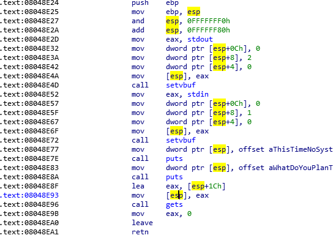
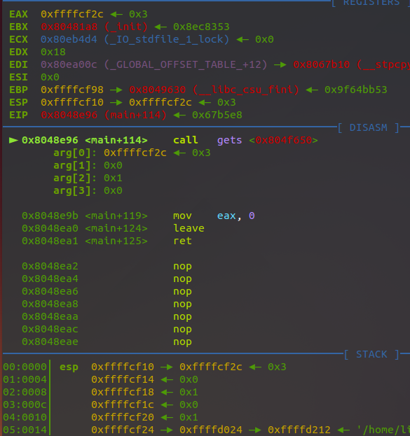

## 解析
1. 先算出緩衝區和返回地址的距離，打開IDA，在main函數中找到gets函數的地址，然後在GDB中對這個地址下斷點，分析各個寄存器的值就可以找出緩衝區和返回地址的位置，在本題中，main函數如下，可知斷點需要設置在0x08048E96處

然後發現緩衝區和ebp的位置差0x6c，所以EIP的位置距離緩衝區爲112

2. 尋找gadget，使用ropper，格式如下
```
ropper --file <afile> --semantic "<any constraint>"
```
尋找字符串使用
```
ropper --file rop --string /bin/sh
```
尋找向其他寄存器的pop指令
```
ropper --file rop --search "pop eax"
```
尋找int 0x80
```
ropper --file rop --search "int 0x80"
```
3. 構造ROP鏈